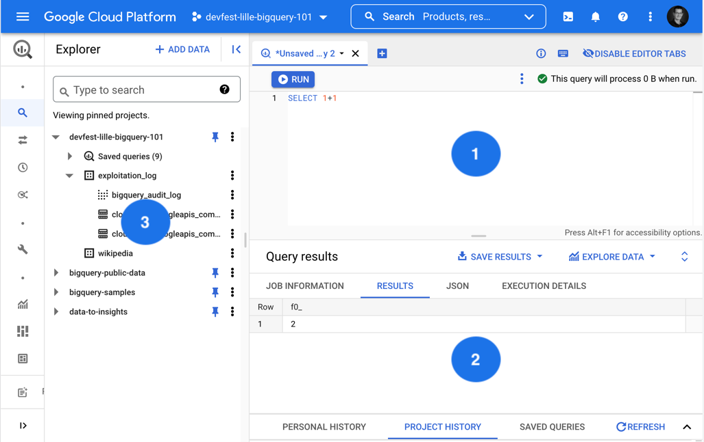
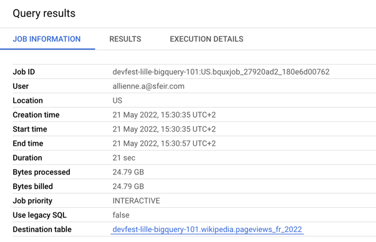
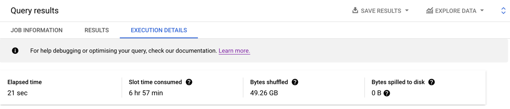
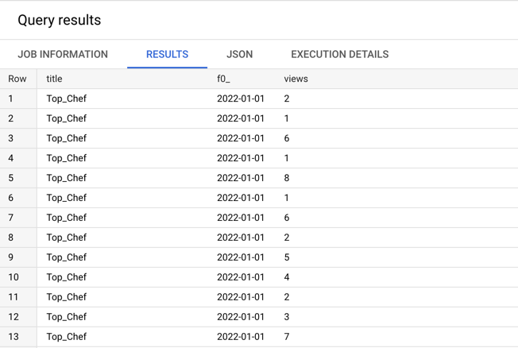
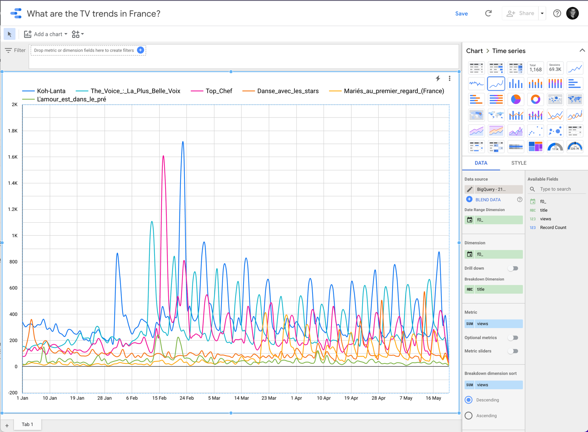
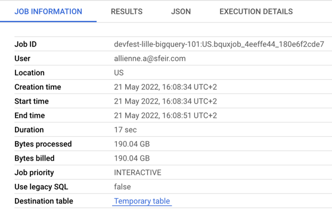

# Introduction to Google BigQuery

This repository contains an end-to-end demo on how to use Google BigQuery with public dataset.

> **Be careful, by clicking on this button, you will run processes on your GCP project. `
> This is directly linked to your billing account. 
> The execution of all the following queries represents an amount of $10.**

## Let's get started!

This repository show multiple examples on how to use Google BigQuery to get information for data.

Follow the steps in this guide to execute your own BigQuery requests!

**Time to complete:** About 15 minutes

## What is Google BigQuery?

Before we jump in, let's briefly go over what Google BigQuery can do.

[Google Cloud documentation](https://cloud.google.com/bigquery/docs/introduction#bigquery-analytics) defines BigQuery like this:

"*BigQuery is a fully managed enterprise data warehouse that helps you manage and
analyze your data with built-in features like machine learning, geospatial analysis,
and business intelligence. BigQuery's serverless architecture lets you use SQL queries
to answer your organization's biggest questions with zero infrastructure management. BigQuery's scalable, distributed analysis engine lets you query terabytes in seconds and petabytes in minutes.*"

## Open the web console

You can use Google Cloud Web Console to interact with BigQuery.

To use it in Google Cloud console, visit [console.cloud.google.com/bigquery](console.cloud.google.com/bigquery).
The opened page should look like this:



The essential parts of this page are:
1. The *Editor* where we will write our SQL requests
2. The *Query results* that display information about execution of our query
3. The *Explorer* to go thought projects, dataset and tables

## Build our own dataset

Google Cloud provides lots of public data directly within BigQuery. You can browse them [here](https://console.cloud.google.com/marketplace/browse?filter=solution-type:dataset&_ga=2.267838222.1264824523.1653136283-1957448354.1629297483&_gac=1.120508538.1652858806.Cj0KCQjwspKUBhCvARIsAB2IYuuHWErOGZ2p-CBnAT7yFW78NXdqQKzkSErvRFB_iyEuz8Rhbu4iy58aAlDeEALw_wcB).

For the purpose of this demo, we will use a common on, the Wikipedia dataset available in the `bigquery-public-data` project.
This dataset provides a number of tables including the `page_views` tables which contain the number of times users of
the wikipedia service have clicked on a unique page per hour.

These tables are quite heavy, from 1.5TB to 2.3TB. To simplify our work and limit execution costs, we are going to work on a sub-dataset, limiting it to French users only, like this:
```sql
CREATE OR REPLACE TABLE
  wikipedia.pageviews_fr_2022
PARTITION BY
  DATE(datehour)
CLUSTER BY
  title OPTIONS( description="Wikipedia pageviews for France, partition by date and clustured by title",
  require_partition_filter=TRUE ) AS
SELECT
  *
FROM
  `bigquery-public-data.wikipedia.pageviews_2022`
WHERE
  DATE(datehour) >= "2022-01-01"
  AND wiki = "fr"
```
With this request, we will create a new table named `wikipedia_fr_2022` in a dataset named `wikipedia`
> Make sure you have created the `wikipedia` dataset before running this query otherwise you will get an error.

This request should process 847GB, at the time of this writing, but with some optimisation mechanism used by BigQuery,
we only be billed for 24,79GB:



As you can see in the *Execution details* tab, the request was executed in about 20 seconds but Google has allocated you nearly 7 hours of compute machines! Awesome!



> You can adapt the dateset by changing selected dates or wiki.

## What are the French looking for the most?

A simple first request can return the TOP 5 of viewed pages in France.
In this request, we'll omit special pages like the homepage.

```sql
SELECT
  title,
  SUM(views) AS total_views
FROM
  `wikipedia.pageviews_fr_2022`
WHERE
  DATE(datehour) >= "2022-01-01"
  AND NOT STARTS_WITH(title, 'Wikipédia:')
  AND NOT STARTS_WITH(title, 'Spécial:')
  AND wiki = "fr"
GROUP BY
  1
ORDER BY
  2 DESC
LIMIT
  5
```

The request returns TOP 5 in 3 seconds:

| title                                                             | total_views |
|-------------------------------------------------------------------|-------------|
| Liste_de_sondages_sur_l'élection_présidentielle_française_de_2022 | 3164436     |
| Michael_Jackson                                                   | 1587252     |
| États-Unis                                                        | 1222191     |
| Charles_Baudelaire                                                | 1118479     |
| France                                                            | 1091169     |


## What are the TV trends in France?

The previous request was cool but not enough. BigQuery is an analytical tool. So we want to get information on historical data.
To do this, we are going to try to measure the audience impact on a sample of French programs.

```sql
SELECT
  title,
  date(datehour),
  views
FROM
  `.wikipedia.pageviews_fr_2022`
WHERE
  date(datehour) >= '2022-01-01'
  AND title IN ( 
    "The_Voice_:_La_Plus_Belle_Voix",
    "Koh-Lanta",
    "Danse_avec_les_stars",
    "L'amour_est_dans_le_pré",
    "Mariés_au_premier_regard_(France)",
    "Top_Chef"
    )
ORDER BY
  2 ASC
```

As you may see in the console, the result is not readable.


To make the data usable, we can use Google Data Studio. It's a free solution for data visualisation integrated with BigQuery.
To create a dashboard that present previous result in a human-readable way, you can do:
1. In the *Query result* tab, on the right, click on *Explore Data* > *Explore Data with Data Studio*
2. A new tab/window should be opened with a default chart : a table
3. We will transform this table to a better chart in this case. Select the *Smoothed time series chart* in the right section.
4. Update the *Metric* to use *Views* instead of *Record Count*

You should see something like:  


You can see that Wikipedia searches are mostly seasonal and related to the airing of the show.

## What's COVID-19 impoct on Wikipedia searched?

> **DO NOT EXECUTE THIS ONE ON YOUR PROJECT**
>
> The related cost is too damned high, around $10!

This request is the last one of this demo. I would like to show how BigQuery will handle processing of more that 5TB of data
by using all wikipedia views since January 1, 2020, in France.

```sql
SELECT
  date(datehour) as d,
  SUM(views) as v
FROM
`bigquery-public-data.wikipedia.pageviews_202*`
WHERE
  date(datehour) >= '2020-01-01'
  AND title LIKE "%Covid%"
  AND wiki = "fr"
  GROUP BY 1
ORDER BY
  1 ASC
```

This query took only 17 seconds to return results! 17s for 5TB!
According to the *Execution details* tab, it would have taken much longer without parallelization (9 hours).


You may ask yourself: "how much cost this kind of request?" and it's normal.
The *Job Information* tab brings a good surprise: we were billed for only 190GB of bytes processed!



If you want to understand why, go back this related [story](https://sn0rks.medium.com/bigquery-101-how-to-tame-the-beast-2a7016de829a) ;) 
